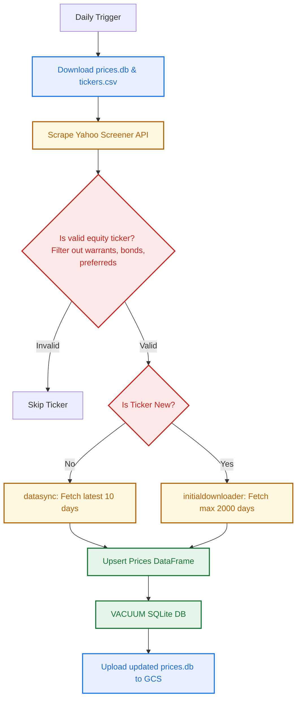
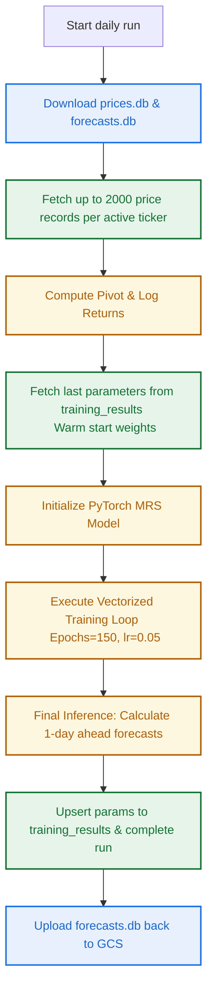

# Trading Regime Forecasts: A GCP-Native Vectorized Markov Regime-Switching Pipeline

## 1. Introduction

This system implements an end-to-end, cloud-native **Trading Regime Forecasting System**. It is structured as a Python-based monorepo running on **Google Cloud Platform (GCP)**. The core engine is a vectorized, three-state **Gaussian Markov Regime-Switching (MRS) model** implemented in **PyTorch**. The system automates:
1. Daily discovery of highly active equity instruments across North America and Europe.
2. Robust, rate-limited incremental market data ingestion and synchronization.
3. Automated database pruning and quality-assurance health checks.
4. Parallel model training and forecasting on high-performance serverless containers.
5. Real-time visualization of forecasted probabilities and statistical parameters through a dashboard.

Crucially, the entire infrastructure operates in a **stateless, serverless** manner. Utilizing Google Cloud Run Jobs, Cloud Scheduler, and Terraform, the system pulls data assets from Google Cloud Storage (GCS), processes them in-memory, updates local SQLite databases, and commits them back to GCS, bypassing the need for expensive persistent volumes.

---

## 2. High-Level System Architecture

The application is architected around a stateless, event-driven pattern on GCP. The central state is maintained inside two SQLite database files stored in a GCS bucket:
*   `prices.db`: The historical price ledger storing daily adjusted close data.
*   `forecasts.db`: The model parameter and forecast probability store.

### Component Interaction Diagram

The following Mermaid diagram illustrates the global architecture, showing how Cloud Scheduler triggers Cloud Run Jobs, which in turn pull from and push back to GCS, and how the Flask web application serves the final results to clients:

```mermaid
flowchart TB
    %% Styling and Theme
    classDef scheduler fill:#ea4335,stroke:#b31412,stroke-width:2px,color:#fff;
    classDef runJob fill:#1a73e8,stroke:#1557b0,stroke-width:2px,color:#fff;
    classDef storage fill:#fbbc05,stroke:#e3a209,stroke-width:2px,color:#202124;
    classDef web fill:#34a853,stroke:#137333,stroke-width:2px,color:#fff;
    classDef client fill:#f1f3f4,stroke:#dadce0,stroke-width:2px,color:#202124;

    subgraph GCP Cloud Environment
        %% Schedulers
        SyncSched["Cloud Scheduler <br> Daily 16:18 EST/EDT <br> (Mon-Fri)"]:::scheduler
        FindSched["Cloud Scheduler <br> Daily 16:39 EST/EDT <br> (Mon-Fri)"]:::scheduler
        CheckSched["Cloud Scheduler <br> Weekly Sat 22:41 EST/EDT"]:::scheduler
        TrainSched["Cloud Scheduler <br> Daily 16:57 EST/EDT <br> (Mon-Fri)"]:::scheduler

        %% Cloud Run Jobs
        SyncJob["datasync-job <br> Cloud Run Job"]:::runJob
        FindJob["findticker-job <br> Cloud Run Job"]:::runJob
        CheckJob["tickerchecker-job <br> Cloud Run Job"]:::runJob
        TrainJob["trainer-job <br> Cloud Run Job"]:::runJob

        %% GCS Storage
        GCS[("GCS Bucket <br> market_data")]:::storage
        
        %% Web Service
        WebService["showresults-service <br> Cloud Run Service"]:::web
    end

    %% Client Layer
    User[Web Client]:::client

    %% Ingestion Schedules to Jobs
    SyncSched -->|Trigger POST| SyncJob
    FindSched -->|Trigger POST| FindJob
    CheckSched -->|Trigger POST| CheckJob
    TrainSched -->|Trigger POST| TrainJob

    %% Cloud Storage interactions
    SyncJob <-->|Read/Write prices.db <br> Read tickers.csv| GCS
    FindJob <-->|Read/Write prices.db & tickers.csv| GCS
    CheckJob <-->|Read/Write prices.db, tickers.csv, & dead_tickers.csv| GCS
    TrainJob <-->|Read prices.db <br> Read/Write forecasts.db| GCS
    WebService <-->|Read forecasts.db <br> Cached 1hr| GCS

    %% Web service user traffic
    User <-->|HTTP Request / View Glassmorphic UI| WebService

    class Def scheduler scheduler;
    class Def runJob runJob;
    class Def storage storage;
    class Def web web;
    class Def client client;
```

---

## 3. Data Acquisition, Discovery, and Synchronization Engine

To maintain high data quality and system stability, the ingestion layer is divided into four distinct micro-pipelines, each deployed as an independent Cloud Run Job.



### 3.1 Daily Data Synchronization (`datasync`)
The `datasync` pipeline runs daily at 16:18 EST/EDT (Monday through Friday). Its objective is to fetch the latest market movements for the currently tracked tickers.
*   **Batching & Rate-Limiting:** To prevent API rate-limiting or IP bans from Yahoo Finance, the system batches the 1200+ active tickers into sub-groups of 200.
*   **Incremental Fetch:** The job requests only the last 10 days of daily data (`period="10d", interval="1d"`). This window is chosen to guarantee overlap and cover extended weekends or trading holidays.
*   **Robust Upsert:** Downloads are structured using `yfinance`. Only the `Adj Close` price is extracted, renamed to `adj_close`, and written using a SQL `INSERT OR REPLACE` query to handle index overlaps cleanly.
*   **exponential Backoff:** Network requests are wrapped in an exponential backoff retry loop to handle intermittent gateway timeouts.

### 3.2 Daily Ticker Discovery (`findticker`)
The `findticker` pipeline executes daily at 16:39 EST/EDT (Monday through Friday) to scan for highly active market equities.
*   **Scraping Active Equities:** The system leverages Yahoo Finance’s screener API by making authenticated requests using cookie and crumb validation. It fetches the top 20 most-active stocks across the United States, Canada, and 30+ European nations.
*   **Strict Security & Filtering Guards:** High-volatility lists often contain debt vehicles, derivatives, and illiquid instruments. To prevent database crashes, `is_valid_equity_ticker` applies strict regex filtering rules:
    *   *Professional Segment Bonds:* Skips any symbol containing `-PRO`.
    *   *Structured Debt / Serial Codes:* Skips any symbol with both hyphens and digits (e.g. `BOND-12`).
    *   *Warrants, Units, Preferreds, Futures:* Filters out suffixes like `-W`, `.WS`, `-P`, `-U`, or `=F`.
*   **MultiIndex & API Normalization:** When using bulk tickers, `yfinance` can return a nested MultiIndex DataFrame. The scraper flattens these columns by dynamically scanning for potential date candidates `['Date', 'Datetime', 'date', 'datetime']` and calling `.columns.get_level_values(0)` to maintain structural integrity.

### 3.3 Historical Backfilling (`initialdownloader`)
Triggered weekly on Sundays at 22:42 EST/EDT, the `initialdownloader` guarantees dataset completeness.
*   **Minimum History Threshold:** The model requires a rich sample to estimate parameters. If a newly discovered ticker contains fewer than 2,000 price records, this pipeline is triggered.
*   **Historical Query:** It requests `period="max"` via `yfinance`, extracts the most recent 2,000 dates, and upserts them into `prices.db`.

### 3.4 Weekly Health Checks (`tickerchecker`)
Running every Saturday at 22:41 EST/EDT, the `tickerchecker` maintains database sanity.
*   **Stale Ticker Identification:** Compares tickers in `prices.db` to identify any ticker whose maximum price date is older than 3 weeks.
*   **Verification & Removal:** Attempts to download the last 3 weeks of price data for these stale tickers. If `yfinance` returns empty records (indicating delisting, symbol renaming, or mergers), the ticker is:
    1.  Removed from the main `tickers.csv` tracking list.
    2.  Logged in a historical audit file `dead_tickers.csv` alongside the failure cause.
    3.  Purged from `prices.db` via `DELETE FROM prices WHERE ticker = ?`.
*   **DB Optimization:** Following large-scale purges, the database is optimized using a SQL `VACUUM` statement to reclaim disk space before GCS upload.

---

## 4. Mathematical Foundations: Markov Regime-Switching Model

Financial returns exhibit stylized facts such as volatility clustering and fat tails. The Markov Regime-Switching model, pioneered by James Hamilton, provides a rigorous framework to model these shifts.

### 4.1 Data Preprocessing: Log Returns
Raw asset prices are non-stationary, rendering direct estimation statistically invalid. We convert adjusted close prices $P_t$ into daily log returns $r_t$:

$$r_t = \ln\left(\frac{P_t}{P_{t-1}}\right) = \ln(P_t) - \ln(P_{t-1})$$

Log returns are used due to their time-additivity and stationarity, satisfying:

$$\sum_{t=1}^k r_t = \ln(P_k) - \ln(P_0)$$

Missing return points (e.g. from illiquid days or country-specific bank holidays) are filled using forward and backward price-filling before taking the difference, and any residual return NaNs are imputed to $0.0$.

### 4.2 Model Definition
Let $r_t \in \mathbb{R}^N$ be the log returns of $N$ assets at time $t$. We model the returns as being governed by an unobserved discrete state variable (regime) $S_t \in \{0, 1, 2\}$ representing three market conditions:
*   State 0: **Bull Regime** (High positive mean)
*   State 1: **Neutral Regime** (Stable sideways mean)
*   State 2: **Bear Regime** (Negative mean)

Conditional on the regime $S_t = j$, returns follow a Gaussian distribution:

$$r_{t} \mid S_t = j \sim \mathcal{N}\left(\mu_j, \sigma_j^2\right)$$

The probability density function (emission density) for regime $j$ at time $t$ is:

$$\eta_{t, j} = f(r_t \mid S_t = j) = \frac{1}{\sqrt{2\pi\sigma_j^2}} \exp\left( -\frac{(r_t - \mu_j)^2}{2\sigma_j^2} \right)$$

### 4.3 Regime Transitions and Constraints
The switching between regimes is governed by a first-order Markov chain with a stationary transition probability matrix $P \in \mathbb{R}^{3 \times 3}$:

$$P = \begin{pmatrix} p_{00} & p_{01} & p_{02} \\ p_{10} & p_{11} & p_{12} \\ p_{20} & p_{21} & p_{22} \end{pmatrix}$$

where $p_{ij} = \mathbb{P}(S_t = j \mid S_{t-1} = i)$ represent transition probabilities, satisfying the row-stochastic constraint:

$$\sum_{j=0}^2 p_{ij} = 1, \quad \forall i \in \{0,1,2\}$$

#### 4.3.1 Enforcing the Ordering Constraint (Solving Label Switching)
A major challenge in mixture and regime-switching models is *label switching* during gradient descent: states can swap definitions, making a bull state bear-like and vice versa. 

To enforce the physical definition $\mu_{\text{bear}} \le \mu_{\text{neutral}} \le \mu_{\text{bull}}$, the system implements a strict, elegant exponential reparameterization. Let the unconstrained parameters optimized directly by PyTorch's autograd be $\alpha$, $\beta$, and $\gamma$:

$$\mu_{\text{bear}} = \alpha$$

$$\mu_{\text{neutral}} = \alpha + e^\beta$$

$$\mu_{\text{bull}} = \alpha + e^\beta + e^\gamma$$

Because the exponential function is strictly positive ($e^x > 0$ for all $x \in \mathbb{R}$), this formulation mathematically guarantees the desired ordered constraint:

$$\mu_{\text{bear}} \le \mu_{\text{neutral}} \le \mu_{\text{bull}}$$

#### 4.3.2 Enforcing Volatility and Probability Constraints
*   **Standard Deviation Constraint:** Volatility must remain positive. We optimize `raw_sigma` in the unconstrained space:

$$\sigma_k = e^{\text{raw\\_sigma}_k}$$

*   **Transition Probability Constraint:** Transition rows must sum to 1. We optimize unconstrained logit matrices `raw_trans_mat` and apply a softmax activation along the rows:

$$p_{ij} = \text{softmax}(\text{raw\\_trans\\_mat}_{i,j}) = \frac{e^{\text{raw\\_trans\\_mat}_{i,j}}}{\sum_{k=0}^2 e^{\text{raw\\_trans\\_mat}_{i,k}}}$$

---

### 4.4 The Hamilton Filter Algorithm
The Hamilton Filter recursively estimates the probability distribution of the hidden states given past and present returns. Let $\xi_{t \mid t}$ be the vector of filtered probabilities at time $t$:

$$\xi_{t \mid t} = \begin{pmatrix} \mathbb{P}(S_t = 0 \mid Y_t) \\ \mathbb{P}(S_t = 1 \mid Y_t) \\ \mathbb{P}(S_t = 2 \mid Y_t) \end{pmatrix}$$

where $Y_t = \{r_1, r_2, \dots, r_t\}$ denotes all observed information up to time $t$. The filter alternates between prediction, emission evaluation, and updating:

#### 1. Prediction Step
Calculate the prior state probabilities for time $t$ given information up to $t-1$:

$$\xi_{t \mid t-1} = \xi_{t-1 \mid t-1} \cdot P$$

$$\mathbb{P}(S_t = j \mid Y_{t-1}) = \sum_{i=0}^2 \mathbb{P}(S_{t-1} = i \mid Y_{t-1}) \cdot p_{ij}$$

#### 2. Emission Step
Evaluate the likelihood density vector $\eta_t$ for each state $j$:

$$\eta_t = \begin{pmatrix} f(r_t \mid S_t = 0) \\ f(r_t \mid S_t = 1) \\ f(r_t \mid S_t = 2) \end{pmatrix}$$

#### 3. Update Step
Calculate the posterior (filtered) state probabilities by combining the prior probabilities and emission densities, normalizing by the marginal density:

$$\xi_{t \mid t} = \frac{\xi_{t \mid t-1} \odot \eta_t}{\mathbf{1}^T (\xi_{t \mid t-1} \odot \eta_t)}$$

$$\mathbb{P}(S_t = j \mid Y_t) = \frac{\mathbb{P}(S_t = j \mid Y_{t-1}) \cdot f(r_t \mid S_t = j)}{\sum_{k=0}^2 \mathbb{P}(S_t = k \mid Y_{t-1}) \cdot f(r_t \mid S_t = k)}$$

where $\odot$ represents the element-wise Hadamard product. The denominator represents the conditional density of the return observation at time $t$:

$$f(r_t \mid Y_{t-1}) = \sum_{k=0}^2 \mathbb{P}(S_t = k \mid Y_{t-1}) \cdot f(r_t \mid S_t = k)$$

The negative log-likelihood contribution for time $t$ is:

$$\ln L_t = \ln \left( \sum_{k=0}^2 \mathbb{P}(S_t = k \mid Y_{t-1}) \cdot f(r_t \mid S_t = k) \right)$$

---

## 5. ML Optimization & Training Pipeline (`trainer`)

The `trainer` module scales this mathematical framework across multiple assets concurrently.



### 5.1 Vectorized PyTorch Execution
Standard implementations of Markov switching models rely on single-ticker estimation via the Expectation-Maximization (EM) algorithm, which is slow and sequential. This system utilizes a **Vectorized Batched PyTorch Model**.
*   **Dimensions:** Tensors are defined in three dimensions: $T$ (time steps $\approx 2000$), $N$ (number of assets $\approx 1200$), and $K$ (states $= 3$).
*   **Batch Operations:** The prediction step utilizes parallel batch matrix multiplications (`torch.bmm`) across the $N$ dimension.
*   **Numerical Precision:** The filter operations utilize `torch.float64` (double precision) and include a small epsilon threshold ($\epsilon = 10^{-12}$) to prevent floating-point underflow in marginal density calculations.

### 5.2 Objective Function and Multi-Objective Penalties
The PyTorch model optimizes the parameters via gradient descent using the Adam optimizer ($lr=0.05$). The total loss function minimized is:

$$\text{Loss} = \text{NLL} + \mathcal{L}_{\text{occ}} + \mathcal{L}_{\text{pers}} + \mathcal{L}_{\text{vol}}$$

#### 1. Negative Log-Likelihood (NLL)
Estimates the joint return probability:

$$\text{NLL} = -\frac{1}{N} \sum_{n=1}^N \sum_{t=1}^T \ln f(r_{n,t} \mid Y_{n, t-1})$$

#### 2. Bayesian State Occupancy Prior ($\mathcal{L}_{\text{occ}}$)
Prevents the model from degenerating into a single, dominant state. It penalizes the mean state probability deviation from a balanced target distribution ($30\%$ bull, $40\%$ neutral, $30\%$ bear) with weight $\lambda_{\text{occ}} = 50.0$:

$$\bar{w}_k = \frac{1}{N \cdot T} \sum_{n=1}^N \sum_{t=1}^T \mathbb{P}(S_{n,t} = k \mid Y_{n,t})$$

$$\mathcal{L}_{\text{occ}} = \lambda_{\text{occ}} \sum_{k=0}^2 \left( \bar{w}_k - w_{\text{target}, k} \right)^2$$

#### 3. Transition Persistence Penalty ($\mathcal{L}_{\text{pers}}$)
Market regimes tend to be highly persistent. This penalty encourages diagonal elements of the transition matrix ($p_{ii}$) to stay above $0.95$, with weight $\lambda_{\text{pers}} = 1000.0$:

$$\mathcal{L}_{\text{pers}} = \lambda_{\text{pers}} \cdot \frac{1}{N \cdot K} \sum_{n=1}^N \sum_{i=0}^2 \max\left(0, 0.95 - p_{n, ii}\right)^2$$

#### 4. Volatility Separation Penalty ($\mathcal{L}_{\text{vol}}$)
Ensures clear volatility separation between the stable neutral state (State 1) and the outer bull/bear regimes (States 0/2), with weight $\lambda_{\text{vol}} = 100.0$:

$$\mathcal{L}_{\text{vol}} = \lambda_{\text{vol}} \cdot \frac{1}{N} \sum_{n=1}^N \left[ \left(\sigma_{n, 0} - \sigma_{n, 1}\right)^2 + \left(\sigma_{n, 2} - \sigma_{n, 1}\right)^2 \right]$$

### 5.3 Parameter Warm-Starting
Rather than retraining the parameters from scratch each day (which can lead to local minima search and chaotic regime shifts), the training orchestrator queries the previous day's completed run from `forecasts.db`. It loads `raw_mu`, `raw_sigma`, and the log logits of the transition matrices to warm-start the model weights, achieving convergence in under 150 epochs.

---

## 6. Presentation and Infrastructure Design

### 6.1 Interactive Glassmorphic Terminal (`showresults`)
The dashboard is a Flask web service providing a highly detailed premium dark terminal layout using modern CSS variables, radial background glows, blur filters, and hover micro-animations.

*   **Expected Return (EV) Calculation:** The UI displays an "Expected Return" column representing the mathematically expected log return of the asset for the next day, derived by weighting state returns by their forecasted 1-day ahead probabilities:

$$\text{EV}_{t+1} = \sum_{k=0}^2 \mathbb{P}(S_{t+1} = k \mid Y_t) \cdot \mu_k$$

*   **Bull-Bear Probability Spread:** Evaluates general directional strength:

$$\text{Spread}_{t+1} = \mathbb{P}(S_{t+1} = 0 \mid Y_t) - \mathbb{P}(S_{t+1} = 2 \mid Y_t)$$

*   **Interactive Features:** Features client-side search and responsive column sorting built directly in vanilla JavaScript to avoid bulky front-end dependencies.
*   **Database In-Memory Caching:** To prevent concurrent GCS request costs, the Flask application caches `forecasts.db` in the container's local `/tmp` directory. It only pulls an update from GCS if the cache is older than 1 hour.

### 6.2 Infrastructure as Code (`infra`)
The system is built on GCP using Terraform to ensure absolute reproducibility and modularity:

*   **Cloud Run Jobs:** The four ingestion pipelines are deployed as GCP Cloud Run Jobs. The `trainer-job` is provisioned with high compute specs (**4Gi Memory, 2 CPUs**) and an execution timeout of **1200 seconds** to handle batched autograd backpropagation on large tensors.
*   **Cloud Run Service:** The `showresults` dashboard is deployed as an auto-scaling serverless Cloud Run Service with public ingress (`allUsers` run invoker).
*   **Unified Service Account:** A customized IAM Service Account `trading-regime-job-sa` is granted minimal-privilege GCS object admin access (`roles/storage.objectAdmin`) and Cloud Run invocation privileges to preserve zero-trust security.
*   **Scheduling Cron Details:**
    *   `datasync-job` $\rightarrow$ `18 16 * * 1-5` (Daily 16:18 EST/EDT, Mon-Fri)
    *   `findticker-job` $\rightarrow$ `39 16 * * 1-5` (Daily 16:39 EST/EDT, Mon-Fri)
    *   `trainer-job` $\rightarrow$ `57 16 * * 1-5` (Daily 16:57 EST/EDT, Mon-Fri)
    *   `tickerchecker-job` $\rightarrow$ `41 22 * * 6` (Weekly Saturdays 22:41 EST/EDT)
    *   `initialdownloader-job` $\rightarrow$ `42 22 * * 0` (Weekly Sundays 22:42 EST/EDT)
