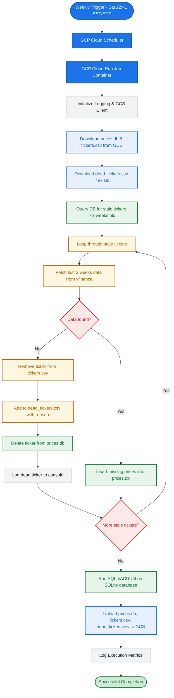

# Objective
Implement a weekly ticker health check pipeline that runs as a GCP Cloud Run Job. It identifies dead or stale tickers by comparing local database state against `yfinance`, removes invalid tickers from the active list (`tickers.csv`), cleans up the `prices.db` SQLite database, and persists the changes to Google Cloud Storage.

# Architecture & Constraints
- **Execution:** GCP Cloud Run Job triggered weekly on Saturdays at 22:41 EST/EDT by Cloud Scheduler.
- **Storage:** "Stateless" execution. The script MUST download `prices.db`, `tickers.csv`, and `dead_tickers.csv` (if it exists) from a GCS bucket at startup, perform operations locally, and upload the updated files back to GCS upon completion. Do NOT use persistent volumes.
- **Tech Stack:** Python 3.12. Strictly utilize `uv` (Skill 301) for dependency management and Docker caching. Do not use `requirements.txt`. Required libraries: `yfinance`, `pandas`, `google-cloud-storage`.

# Proposed Directory & File Structure
This structure ensures a clean separation of concerns and complies with **uv** (Skill 301) and **terraform** (Skill 340) best practices:

```text
trading-regime/
├── tickerchecker/             # Core weekly ticker checker application
│   ├── src/                   # Python source directory
│   │   ├── database.py        # SQLite query and deletion helpers
│   │   ├── main.py            # Pipeline orchestrator & GCS interactions
│   │   └── checker.py         # yfinance validation logic
│   ├── tests/                 # Unit and integration test suites
│   │   ├── test_database.py   # Tests SQLite operations
│   │   ├── test_main.py       # Tests main orchestrator and GCS steps
│   │   └── test_checker.py    # Tests yfinance validation logic
│   ├── Dockerfile             # Multi-stage Dockerfile optimized for uv caching
│   ├── pyproject.toml         # uv project configuration and dependencies
│   └── uv.lock                # Lock file generated by uv
├── infra/                     # Infrastructure-as-code for GCP deployment
│   ├── main.tf                # GCP Bucket, Cloud Run Job, and Cloud Scheduler
│   ├── variables.tf           # Configurable deployment inputs
│   ├── outputs.tf             # Outputs like Bucket Name and Job URL
│   └── providers.tf           # GCP provider configuration
└── specs/
    └── 02-ticker-checker.md   # Technical specification (this document)
```

# System Workflow & Business Logic
The following flowchart illustrates the business logic of the weekly ticker checker process:



# Implementation Requirements

## 1. Database Schema & Operations (`tickerchecker/src/database.py`)
- Define operations to query the existing `prices` table (`ticker (TEXT)`, `date (DATE)`, `adj_close (REAL)`).
- Write a query to identify all tickers whose maximum `date` is older than 3 weeks (stale tickers).
- Write a function to delete all records for a specific ticker from the database (for dead tickers).
- Utilize a robust upsert logic (similar to `datasync`) to insert missing prices for tickers that are stale but still have data on yfinance.

## 2. Checker Logic (`tickerchecker/src/checker.py`)
- Iterate through the identified stale tickers.
- For each ticker, attempt to download the last 3 weeks of data using `yfinance`.
- If no data is found (indicating delisting or invalid symbol):
  - Remove the ticker from the locally loaded `tickers.csv`.
  - Append the ticker and the reason (e.g., "yfinance no data") to `dead_tickers.csv`.
  - Delete the ticker's history from the local `prices.db`.
  - Log the action to the console for monitoring.
- If data is found:
  - Extract the "Adj Close" column, format it appropriately, and upsert it into the local `prices.db`.

## 3. Storage & Orchestration (`tickerchecker/src/main.py`)
- Initialize a `pyproject.toml` file in `tickerchecker` using `uv` (Skill 301).
- Use the `google-cloud-storage` client to download `prices.db`, `tickers.csv`, and optionally `dead_tickers.csv` at startup.
- Implement standard Python `logging` (INFO level) to ensure Cloud Logging captures actions like identified dead tickers and row deletions.
- Run `VACUUM` on the SQLite database before the final GCS upload to optimize storage size after potential deletions.
- Ensure the updated `prices.db`, `tickers.csv`, and `dead_tickers.csv` are uploaded back to GCS.

## 4. Containerization (`tickerchecker/Dockerfile`)
- Create a multi-stage Dockerfile optimized for `uv` (Skill 301) to manage dependencies rapidly without relying on `requirements.txt`.

## 5. Testing (`tickerchecker/tests/`)
- Unit test `database.py` (ensure deletion, querying, and upsert logic works).
- Unit test `checker.py` (mock yfinance to test both "data found" and "no data" paths).
- Unit test `main.py` (test GCS interactions).
- Lint the Dockerfile and perform a container smoke/integration test.

## 6. Deployment
- Provide the Python application code, the Dockerfile, and the Terraform code (using the `340-terraform` skill) required to deploy the Cloud Run Job and Cloud Scheduler.
- All Terraform configurations are stored in the `infra/` directory. The schedule must be set to `41 22 * * 6` (Saturdays 22:41) using the `America/New_York` timezone.
