# Objective
Implement a daily market data discovery pipeline that runs as a GCP Cloud Run Job. It scrapes the most active stocks across US, Canada, and Europe via Yahoo Finance, identifies new tickers not yet in our system, downloads their historical adjusted close prices (up to 2000 daily data points), and updates both `tickers.csv` and the SQLite database (`prices.db`) backed by Google Cloud Storage. This specification is designed to be architecturally consistent with `01-data-sync.md`.

> [!IMPORTANT]
> To ensure database schema integrity and prevent ingestion crashes, this pipeline strictly restricts discovery to **standard stocks and equity instruments**. It dynamically filters out listed debt, professional segment bonds, warrants, preferreds, units, and futures before requesting history from yfinance or executing GCS synchronizations.

# Architecture & Constraints
- **Execution:** GCP Cloud Run Job triggered daily (e.g., at 16:39 EST/EDT, Mon-Fri) by Cloud Scheduler.
- **Storage:** "Stateless" execution. The script MUST download `tickers.csv` and `prices.db` from a GCS bucket at startup, perform updates locally, and upload the updated files back to GCS upon completion. Do NOT use persistent volumes.
- **Tech Stack:** Python 3.12. Strictly utilize `uv` (Skill 301) for dependency management and Docker caching. Required libraries: `requests`, `yfinance`, `pandas`, `google-cloud-storage`.

# Proposed Directory & File Structure
This structure ensures a clean separation of concerns and complies with **uv** (Skill 301) and **terraform** (Skill 340) best practices:

```text
trading-regime/
├── findticker/                # Core daily ticker discovery application
│   ├── src/                   # Python source directory
│   │   ├── database.py        # SQLite helper for initial historical data insert
│   │   ├── main.py            # Pipeline orchestrator & GCS interactions
│   │   └── scraper.py         # Yahoo finance screener scraping & yfinance downloads
│   ├── tests/                 # Unit and integration test suites
│   │   ├── test_database.py   # Tests SQLite insert logic
│   │   ├── test_main.py       # Tests main orchestrator and GCS steps
│   │   └── test_scraper.py    # Tests Yahoo finance session and API logic
│   ├── Dockerfile             # Multi-stage Dockerfile optimized for uv caching
│   ├── pyproject.toml         # uv project configuration and dependencies
│   └── uv.lock                # Lock file generated by uv
├── infra/                     # Infrastructure-as-code for GCP deployment
│   └── ...                    # Re-use or extend existing terraform modules
└── specs/
    └── 03-find-ticker.md      # Technical specification (this document)
```

# System Workflow & Business Logic
The following flowchart illustrates the business logic of the ticker discovery and data initialization process, including validation and multi-index column handling safeguards to keep the pipeline stable:

```mermaid
flowchart TD
    %% Styling and Theme
    classDef trigger fill:#1a73e8,stroke:#1557b0,stroke-width:2px,color:#fff;
    classDef startup fill:#f1f3f4,stroke:#dadce0,stroke-width:2px,color:#202124;
    classDef storage fill:#e8f0fe,stroke:#1a73e8,stroke-width:2px,color:#1967d2;
    classDef database fill:#e6f4ea,stroke:#137333,stroke-width:2px,color:#137333;
    classDef process fill:#fef7e0,stroke:#b06000,stroke-width:2px,color:#b06000;
    classDef decision fill:#fce8e6,stroke:#c5221f,stroke-width:2px,color:#c5221f;
    classDef finish fill:#ceead6,stroke:#137333,stroke-width:2px,color:#137333;

    %% Workflow Nodes
    Start(["Daily Trigger 16:39 EST/EDT (Mon-Fri)"]) --> Scheduler[GCP Cloud Scheduler]
    Scheduler --> Job[GCP Cloud Run Job Container]
    
    %% Startup Phase
    Job --> InitLog[Initialize Logging & GCS Client]
    
    %% GCS Interaction
    InitLog --> DLFiles[Download tickers.csv & prices.db from GCS]
    DLFiles --> LoadCSV[Load existing tickers from CSV]
    
    %% Scraping Phase
    LoadCSV --> ScrapeTickers[Scrape Most Active Stocks from Yahoo Finance]
    ScrapeTickers --> IdentifyNew{Are there new tickers?}
    
    IdentifyNew -- No --> TeardownClean[Log 'No new tickers' & Exit]
    
    %% Processing New Tickers
    IdentifyNew -- Yes --> AppendCSV[Append new tickers to local tickers.csv]
    AppendCSV --> LoopNew[Iterate over new tickers]
    
    %% Validation Guard Check
    LoopNew --> GuardCheck{"Is Professional Bond?\n(Contains '-PRO')"}
    GuardCheck -- Yes --> SkipT["Skip Ticker & Log Warning"]:::decision
    GuardCheck -- No --> SuffixCheck{"Is Warrant, Unit,\nPreferred, or Future?"}:::decision
    
    SuffixCheck -- Yes --> SkipT
    SuffixCheck -- No --> BondPatternCheck{"Does symbol have digits\nAND a hyphen? \n(eg 'BOND-12')"}:::decision
    
    BondPatternCheck -- Yes --> SkipT
    BondPatternCheck -- No --> FetchHist[Fetch data via yfinance as string]
    
    %% API Response Normalization
    FetchHist --> CheckCol{Is DataFrame Column\nMultiIndex?}:::decision
    CheckCol -- Yes --> Flatten[Flatten Column Index via get_level_values]:::process
    CheckCol -- No --> ProcessData[Extract 'Adj Close']
    Flatten --> ProcessData
    
    %% Normalization & SQLite Insert
    ProcessData --> ResetIdx[Reset Index & Normalize Date Column]:::process
    ResetIdx --> DB_Insert[Insert historical data into local prices.db]
    
    SkipT --> CheckMore{More new tickers?}:::decision
    DB_Insert --> CheckMore
    CheckMore -- Yes --> LoopNew
    
    %% Teardown Phase
    CheckMore -- No --> UploadFiles[Upload updated tickers.csv & prices.db to GCS]
    UploadFiles --> FinalLog[Log Execution Metrics]
    FinalLog --> End(["Successful Completion"])
    TeardownClean --> End

    %% Class Assignments
    class Start,Scheduler,Job trigger;
    class InitLog,FinalLog startup;
    class DLFiles,LoadCSV,UploadFiles storage;
    class AppendCSV,DB_Insert database;
    class ScrapeTickers,LoopNew,FetchHist,ProcessData process;
    class IdentifyNew,CheckMore decision;
    class End,TeardownClean finish;
```




# Implementation Requirements

## 1. Scraping Logic (`findticker/src/scraper.py`)
- Implement the Yahoo Finance session and crumb retrieval logic.
- POST to the screener API to fetch the most active stocks across specified regions (US, Canada, Europe).
- Return a list of the parsed stock symbols.
- Use `yfinance` to download historical data (`period="max"` or up to `2000d`, `interval="1d"`) for newly discovered tickers.
- **Strict Stock/Equity Filtering:** Implement `is_valid_equity_ticker` to filter out professional segment bonds (`-PRO`), warrants (`-W`, `.WS`), preferred shares (`-P`), units (`-U`), futures (`=F`), and structured debt serial code patterns (symbols with both hyphens and digits).
- **MultiIndex Safe-Flattening:** Pass the raw `ticker` string instead of list `[ticker]` to `yf.download` to avoid multi-ticker DataFrame layouts. If a MultiIndex is returned, immediately flatten it using `.columns.get_level_values(0)` before index resetting.
- **Dynamic Date Normalization:** Scan and extract date column names resiliently using candidate fields `['Date', 'Datetime', 'date', 'datetime']` to decouple from internal pandas/yfinance formatting alterations.

## 2. Database Integration (`findticker/src/database.py`)
- Define SQLite connection helpers for the local `prices.db`.
- Write logic to append initial historical data for newly discovered tickers to the `prices` table (`ticker`, `date`, `adj_close`).
- Ensure the table schema perfectly matches the specifications defined in `01-data-sync.md`.

## 3. Storage & Orchestration (`findticker/src/main.py`)
- Initialize a `pyproject.toml` file in `findticker` using `uv` (Skill 301) for dependency management.
- Use `google-cloud-storage` to download both `tickers.csv` and `prices.db` at runtime.
- Read `tickers.csv` to identify the existing set of known tickers.
- Compare scraped tickers against the known set. Skip tickers that already exist.
- Append newly identified tickers to the local `tickers.csv`.
- Upload both the modified `tickers.csv` and `prices.db` back to the GCS bucket at the end of the run.

## 4. Containerization (`findticker/Dockerfile`)
- Create a multi-stage Dockerfile optimized for `uv` caching, similar to the `datasync` job container.

## 5. Testing (`findticker/tests/`)
- Unit test database inserts and CSV appending logic.
- Unit test scraping functionality (mocking the `requests.Session` and Yahoo Finance API response).
- **Validation Guard Testing:** Verify that validation rules correctly accept standard stock tickers and reject professional debt, warrants, preferreds, units, and futures, confirming that `fetch_historical_data` cleanly bypasses invalid symbols.
- Integration test for the main orchestrator with mocked GCS clients.

## 6. Deployment
- The GCP Cloud Run Job and Cloud Scheduler should be managed via Terraform (`infra/`), extending existing configurations using the `340-terraform` skill principles.


## Appendix: Code

```python
"""
Fetches the 20 most active stocks from Yahoo Finance's screener API,
filtered to: United States, Canada, and all major European countries.

Usage:
    pip install requests
    python get_most_active_stocks.py

How it works:
    1. Opens a session with finance.yahoo.com to obtain session cookies.
    2. Retrieves a crumb token (required for authenticated API calls).
    3. POSTs to the Yahoo Finance screener endpoint with region filters
       and a volume-descending sort to get the most-active stocks.
"""

import sys
import requests

# ---------------------------------------------------------------------------
# Region configuration
# ---------------------------------------------------------------------------

# Yahoo Finance region codes for US, Canada, and European countries
REGIONS = [
    # North America
    "us",   # United States
    "ca",   # Canada

    # Western Europe
    "gb",   # United Kingdom
    "de",   # Germany
    "fr",   # France
    "it",   # Italy
    "es",   # Spain
    "nl",   # Netherlands
    "be",   # Belgium
    "at",   # Austria
    "ch",   # Switzerland
    "pt",   # Portugal
    "ie",   # Ireland
    "lu",   # Luxembourg
    "mc",   # Monaco

    # Northern Europe
    "se",   # Sweden
    "no",   # Norway
    "dk",   # Denmark
    "fi",   # Finland
    "is",   # Iceland

    # Eastern Europe
    "pl",   # Poland
    "cz",   # Czech Republic
    "sk",   # Slovakia
    "hu",   # Hungary
    "ro",   # Romania
    "bg",   # Bulgaria
    "hr",   # Croatia
    "si",   # Slovenia
    "ee",   # Estonia
    "lv",   # Latvia
    "lt",   # Lithuania

    # Southern / Southeastern Europe
    "gr",   # Greece
    "cy",   # Cyprus
    "mt",   # Malta
    "rs",   # Serbia
    "ba",   # Bosnia and Herzegovina
    "me",   # Montenegro
    "mk",   # North Macedonia
    "al",   # Albania
    "tr",   # Turkey

    # Other European
    "ua",   # Ukraine
]

TOP_N = 20

HEADERS = {
    "User-Agent": (
        "Mozilla/5.0 (Windows NT 10.0; Win64; x64) "
        "AppleWebKit/537.36 (KHTML, like Gecko) "
        "Chrome/124.0.0.0 Safari/537.36"
    ),
    "Accept": "text/html,application/xhtml+xml,application/xml;q=0.9,*/*;q=0.8",
    "Accept-Language": "en-US,en;q=0.9",
}


# ---------------------------------------------------------------------------
# Step 1 & 2: Establish session and obtain crumb
# ---------------------------------------------------------------------------

def get_session_and_crumb() -> tuple[requests.Session, str]:
    """
    Visit finance.yahoo.com to set cookies, then fetch the API crumb.
    Returns (session, crumb_string).
    """
    session = requests.Session()
    session.headers.update(HEADERS)

    # Warm up the session (sets cookies like A3, GUC, etc.)
    warmup = session.get(
        "https://finance.yahoo.com",
        timeout=15,
        allow_redirects=True,
    )
    warmup.raise_for_status()

    # Fetch the crumb required for authenticated API calls
    crumb_url = "https://query1.finance.yahoo.com/v1/test/getcrumb"
    crumb_resp = session.get(crumb_url, timeout=10)
    if crumb_resp.status_code != 200 or not crumb_resp.text.strip():
        # Fallback: try query2
        crumb_url2 = "https://query2.finance.yahoo.com/v1/test/getcrumb"
        crumb_resp = session.get(crumb_url2, timeout=10)
        crumb_resp.raise_for_status()

    crumb = crumb_resp.text.strip()
    if not crumb:
        raise RuntimeError("Failed to retrieve Yahoo Finance crumb token.")

    return session, crumb


# ---------------------------------------------------------------------------
# Step 3: Build screener payload and query
# ---------------------------------------------------------------------------

def build_screener_payload(regions: list[str], size: int = 20) -> dict:
    """Return the POST body for Yahoo Finance's /v1/finance/screener."""
    region_operands = [
        {"operator": "EQ", "operands": ["region", r]}
        for r in regions
    ]
    return {
        "offset": 0,
        "size": size,
        "sortField": "dayvolume",
        "sortType": "DESC",
        "quoteType": "EQUITY",
        "query": {
            "operator": "AND",
            "operands": [
                {
                    "operator": "or",
                    "operands": region_operands,
                }
            ],
        },
        "userId": "",
        "userIdType": "guid",
    }


def fetch_most_active(
    session: requests.Session,
    crumb: str,
    regions: list[str],
    top_n: int = 20,
) -> list[dict]:
    """POST to the screener API and return raw quote dicts."""
    url = "https://query1.finance.yahoo.com/v1/finance/screener"
    params = {
        "crumb": crumb,
        "lang": "en-US",
        "region": "US",
        "formatted": "false",
        "corsDomain": "finance.yahoo.com",
    }
    payload = build_screener_payload(regions, size=top_n)

    resp = session.post(url, params=params, json=payload, timeout=15)

    # Try query2 on failure
    if resp.status_code != 200:
        url2 = "https://query2.finance.yahoo.com/v1/finance/screener"
        resp = session.post(url2, params=params, json=payload, timeout=15)
        resp.raise_for_status()

    data = resp.json()

    try:
        quotes = data["finance"]["result"][0]["quotes"]
    except (KeyError, IndexError, TypeError) as exc:
        raise RuntimeError(
            f"Unexpected API response structure: {exc}\n"
            f"Response (first 500 chars): {resp.text[:500]}"
        ) from exc

    return quotes


# ---------------------------------------------------------------------------
# Main
# ---------------------------------------------------------------------------

def main() -> list[str]:
    print(f"Fetching top {TOP_N} most-active stocks (US, Canada, and Europe)...")
    print(f"Querying {len(REGIONS)} regions: {', '.join(r.upper() for r in REGIONS)}\n")

    # Auth
    print("Step 1/2: Establishing Yahoo Finance session and obtaining crumb...")
    session, crumb = get_session_and_crumb()
    print(f"          Crumb obtained: {crumb!r}\n")

    # Fetch
    print("Step 2/2: Querying screener API...")
    quotes = fetch_most_active(session, crumb, REGIONS, top_n=TOP_N)
    print(f"          Received {len(quotes)} results.\n")

    # Display
    print(f"{'#':<4} {'Ticker':<12} {'Name':<36} {'Region':<8} {'Volume':>15}")
    print("─" * 79)
    for i, q in enumerate(quotes, start=1):
        symbol = q.get("symbol", "N/A")
        name   = (q.get("shortName") or q.get("longName") or "—")[:35]
        region = q.get("region", "—").upper()
        volume = q.get("regularMarketVolume") or q.get("averageDailyVolume3Month") or 0
        print(f"{i:<4} {symbol:<12} {name:<36} {region:<8} {volume:>15,.0f}")
    print("─" * 79)

    tickers = [q.get("symbol", "N/A") for q in quotes]
    print(f"\n✅ Top {TOP_N} tickers:")
    print(tickers)

    return tickers


if __name__ == "__main__":
    try:
        main()
    except KeyboardInterrupt:
        sys.exit(0)
    except Exception as e:
        print(f"\n❌ Error: {e}", file=sys.stderr)
        sys.exit(1)
```

