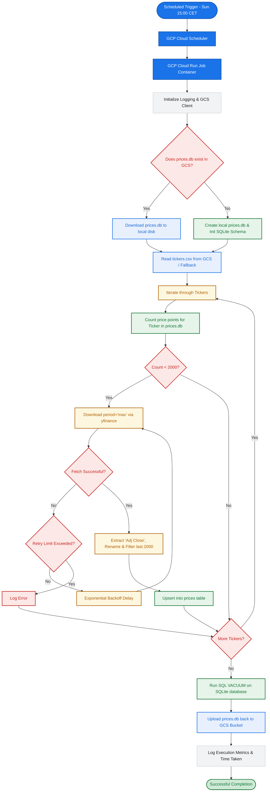

# Objective
Implement an initial download pipeline that runs as a GCP Cloud Run Job. It checks the number of price points in a SQLite database (`prices.db`) backed by Google Cloud Storage. If a ticker has less than 2000 price points, it downloads the missing price points via `yfinance` and stores them.

# Architecture & Constraints
- **Execution:** GCP Cloud Run Job triggered on a schedule (Sunday 15:00 CET) via Cloud Scheduler.
- **Storage:** "Stateless" execution. The script MUST download `prices.db` from a GCS bucket at startup, perform database updates locally, and upload the updated `prices.db` back to GCS upon completion.
- **Tech Stack:** Python 3.12. Strictly utilize `uv` (Skill 301) for dependency management and Docker caching. Required libraries: `yfinance`, `pandas`, `google-cloud-storage`.

# Proposed Directory & File Structure
```text
trading-regime/
├── initialdownloader/         # Core initial download application
│   ├── src/                   # Python source directory
│   │   ├── database.py        # SQLite schema definition and upsert helper
│   │   ├── main.py            # Pipeline orchestrator & GCS interactions
│   │   └── download.py        # yfinance download and logic for 2000 price points
│   ├── tests/                 # Unit and integration test suites
│   │   ├── test_database.py   # Tests SQLite schema and upsert logic
│   │   ├── test_main.py       # Tests main orchestrator and GCS steps
│   │   └── test_download.py   # Tests yfinance mock and download logic
│   ├── Dockerfile             # Multi-stage Dockerfile optimized for uv caching
│   ├── pyproject.toml         # uv project configuration and dependencies
│   └── uv.lock                # Lock file generated by uv
├── infra/                     # Infrastructure-as-code for GCP deployment
│   └── main.tf                # GCP Bucket, Cloud Run Job, and Cloud Scheduler
└── specs/
    └── 04-initial-download.md # Technical specification (this document)
```

# System Workflow & Business Logic


# Implementation Requirements

## 1. Database Schema (`initialdownloader/src/database.py`)
- Define the SQLite schema for a `prices` table: `ticker (TEXT)`, `date (DATE)`, `adj_close (REAL)`. Primary Key is `(ticker, date)`.
- Write a helper SQL query to check the number of price points per ticker: `SELECT COUNT(*) FROM prices WHERE ticker = ?`.
- Write a robust upsert function to handle Pandas DataFrames being inserted into SQLite to avoid duplicate primary key errors.

## 2. Download Logic (`initialdownloader/src/download.py`)
- Read a list of tickers from a GCS-hosted `tickers.csv` (or default to a hardcoded list for testing).
- Process each ticker and check the count of points. If the count is less than 2000, use `yfinance` to download historical data (e.g. `period="max"`).
- Filter the latest 2000 data points if more are returned.
- Extract only the "Adj Close" column, rename it to `adj_close`, reshape the dataframe, and upsert into the SQLite `prices` table.
- Implement a retry mechanism with exponential backoff for `yfinance` network calls.

## 3. Storage & Orchestration (`initialdownloader/src/main.py`)
- Initialize a `pyproject.toml` file in `initialdownloader` using `uv` (Skill 301) to manage the Python dependencies.
- Use the `google-cloud-storage` client to handle the download and upload of `prices.db`.
- Implement standard Python `logging` (INFO level) instead of print statements to ensure GCP Cloud Logging captures execution metrics (rows updated, time taken, errors).
- Run `VACUUM` on the SQLite database before the final GCS upload to optimize storage size.

## 4. Containerization (`initialdownloader/Dockerfile`)
- Create a multi-stage Dockerfile optimized for `uv` (as per Skill 301) that copies the `pyproject.toml` and installs dependencies rapidly and securely.

## 5. Testing (`initialdownloader/tests/`)
- Unit test `database.py`.
- Unit test `download.py`.
- Unit test `main.py`.
- Lint Dockerfile and perform a container smoke/integration test.

## 6. Deployment
Implement the Python application code, the Dockerfile, and provide the Terraform code (using the `340-terraform` skill) required to deploy the Cloud Run Job and Cloud Scheduler.
