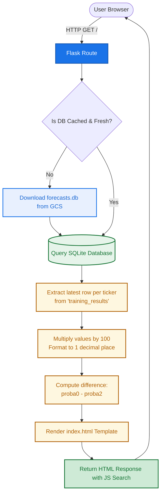

# Objective
Implement a lightweight web application that runs as a GCP Cloud Run Service to display the latest model forecasts. The application will serve a user-friendly HTML table with search capabilities, backed by a Flask API that queries the `forecasts.db` SQLite database stored in Google Cloud Storage (GCS).

# Architecture & Constraints
- **Execution:** GCP Cloud Run Service serving HTTP traffic.
- **Storage:** "Stateless" execution. The application will download `forecasts.db` from a GCS bucket on startup or cache it locally for read-only querying.
- **Tech Stack:** Python 3.12, Flask, Jinja2, HTML/Vanilla JS (for search functionality). Strictly utilize `uv` (Skill 301) for dependency management and Docker caching. Required libraries: `flask`, `google-cloud-storage`, `sqlite3` (built-in).

# Proposed Directory & File Structure
This structure ensures a clean separation of concerns and complies with **uv** (Skill 301) and **terraform** (Skill 340) best practices:

```text
trading-regime/
├── showresults/               # Web application for displaying forecasts
│   ├── src/                   # Python source directory
│   │   ├── app.py             # Flask application factory and routes
│   │   ├── database.py        # SQLite query logic and GCS download handler
│   │   ├── static/            # CSS and JavaScript assets
│   │   │   └── style.css      # Vanilla CSS for styling
│   │   └── templates/         # HTML Jinja2 templates
│   │       └── index.html     # Main table view with search logic
│   ├── tests/                 # Unit and integration test suites
│   │   ├── test_app.py        # Tests Flask routes
│   │   └── test_database.py   # Tests query extraction and math logic
│   ├── Dockerfile             # Multi-stage Dockerfile optimized for uv caching
│   ├── pyproject.toml         # uv project configuration and dependencies
│   └── uv.lock                # Lock file generated by uv
├── infra/                     # Infrastructure-as-code for GCP deployment
│   └── ...                    # Extend existing terraform modules for Cloud Run Service
└── specs/
    └── 07-results.md          # Technical specification (this document)
```

# System Workflow & Business Logic



# Implementation Requirements

## 1. Storage & Database (`showresults/src/database.py`)
- **GCS Integration:** Implement a helper to download `forecasts.db` from the designated GCP storage bucket to a local temporary directory (e.g., `/tmp/forecasts.db`). To optimize performance, implement basic caching so the file is only downloaded if it is missing or older than a specific threshold (e.g., 1 hour).
- **SQLite Querying:** Connect to the local `forecasts.db` and query the `training_results` table.
- **Aggregation:** Group the data by `ticker` and extract only the latest/last row for each ticker based on the date or primary key.

## 2. Business Logic & Math Formatting
For each retrieved row, apply the following transformations:
- **Columns to include:** `ticker`, `nll`, `mu0`, `mu1`, `mu2`, `proba0`, `proba1`, `proba2`.
- **Formatting:** 
  - Multiply `mu0`, `mu1`, `mu2` by 100 and round to 1 decimal digit.
  - Multiply `proba0`, `proba1`, `proba2` by 100 and round to 1 decimal digit.
- **Computed Column:** Calculate a new metric `proba0 - proba2`, multiplied by 100 and rounded to 1 decimal digit. This represents the probability spread between the lowest and highest regimes.

## 3. Web Layer (`showresults/src/app.py` & `templates/index.html`)
- **Flask App:** Define a lightweight Flask application with a single root route (`/`).
- **Template Rendering:** Pass the processed dictionary/list of results to `index.html`.
- **Frontend UI:**
  - Build an HTML table to display the columns: `Ticker`, `NLL`, `Mu0`, `Mu1`, `Mu2`, `Proba0`, `Proba1`, `Proba2`, and `Proba0 - Proba2`.
  - **Search Functionality:** Implement Vanilla JavaScript on the client side to filter table rows dynamically based on the `Ticker` input field. 
  - Ensure the design is clean, responsive, and easy to read. The table is sortable by clicking on the column headers.

## 4. Containerization (`showresults/Dockerfile`)
- Create a multi-stage Dockerfile utilizing `uv` for ultra-fast, cached dependency installation.
- Expose the port specified by the `PORT` environment variable (default 8080) required by Cloud Run.
- Use a production-ready WSGI server like `gunicorn` to serve the Flask app.

## 5. Deployment
- Deploy via Terraform in `infra/` as a **Cloud Run Service** (not a Job, since it serves web traffic).
- Ensure the service account attached to the Cloud Run Service has the `roles/storage.objectViewer` permission to read `forecasts.db` from GCS.
